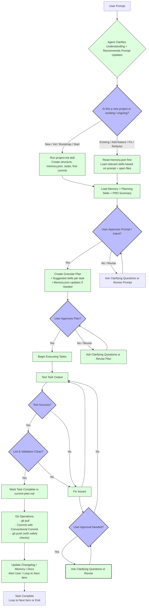

# Gravity Boots - An Antigravity Boilerplate

A reusable Git template repo for high-performance agentic coding with Antigravity. Supports legacy (PHP/WordPress/LAMP) and modern stacks (Python/FastAPI, Next.js/React Native) with modular skills, planning docs, persistent memory, MCP for external references, and optimized context loading.

## Quick Start

1. Clone this repo as a template (via "Use this template" on GitHub) or fork it for a new project.

2. Open in Antigravity as a workspace.

3.  **Initialize Project**:
    *   **Auto**: Prompt the agent "Initialize this new project".
    *   **Manual**: Run `python .agent/tools/init_project.py "My Project Name"`.
    *   This creates folder structures, `memory.json`, and initial docs.

4.  **Customize**:
    *   **Required**: Edit `/docs/planning/prd.md` with your project vision.
    *   **Optional**: Fill out `scope.md`, `technical-specs.md`, and `user-stories.md` for better agent guidance.
    *   Review `.agent/skills/` and `skills-manifest.md` to see available capabilities.
    *   Run local install commands for dependencies (e.g., `composer install` or `npm install`).

5. Start prompting for features:  
   "Add user authentication with OAuth"  
   The agent will follow the workflow in docs/planning/agent-workflow.md.

## Folder Structure Overview
gravity-boots/
├── .agent/                               # Agent config
│   ├── skills/                           # Modular skills (flat)
│   │   └── project-init/                 # Example: the init skill
│   │       └── SKILL.md
│   ├── rules/                            # Agent rules (coding standards)
│   │   ├── php-standards.md
│   │   └── ...
│   └── tools/                            # Helper scripts
│       └── memory_manager.py             # Memory management
├── docs/                                 # Documentation
│   ├── planning/                         # Project planning
│   │   ├── prd.md
│   │   ├── scope.md
│   │   ├── technical-specs.md
│   │   ├── user-stories.md
│   │   ├── definition-of-done.md
│   │   ├── current-plan.md               # Active task plan
│   │   └── agent-workflow.md             # Workflow diagram + steps
│   ├── context/                          # Runtime state
│   │   └── memory.json                   # Persistent memory
│   └── mcp/                              # Mounted Context Protocol (external docs)
│       └── laravel-11-guide.md           # Example: Laravel docs
├── sql/                                  # Generated SQL scripts
├── examples/                             # Generated examples
│   └── json/                             # JSON fixtures
├── src/                                  # Code
│   ├── backend/                          # PHP / Python
│   │   ├── python/                       # FastAPI/Django/Flask stubs
│   │   └── php/                          # Laravel/Symfony stubs
│   └── frontend/                         # Next.js / React Native
├── .env.example                          # Env vars template
├── .gitignore                            # Standard ignores
├── AGENTS.md                             # Agent persona/rules
├── README.md                             # This file
└── skills-manifest.md                    # Skills list/reference

## Agent Workflow (Mermaid Diagram)

## Key Features
* Modular skills with progressive loading (1–4 active at a time)
* Persistent memory.json for state across sessions
* MCP for external docs (/docs/mcp/)
* Yes/no approval loop + silent execution mode
* Artifact organization (/sql/, /examples/json/)
* Rule-based coding standards (.agent/rules/) for auto-compliance
* Lint/validation before commits
* Supports mixed stacks: PHP, Python, Next.js, etc.

## Deployment & Production
**Important**: The `.agent/` folder, `docs/`, and `AGENTS.md` are your "Source Code for the Agent". 
1.  **Repository**: Keep these files in Git. The agent needs them to understand and build your project.
2.  **Production Server**: Exclude them. They are not needed for the runtime application.
    *   Use `.dockerignore` (provided) to exclude them from container builds.
    *   Use `rsync --exclude-from` if deploying via SSH.

## Contributing
Pull requests welcome! Please use Conventional Commits.

## License
MIT License

Last Updated: January 23, 2026